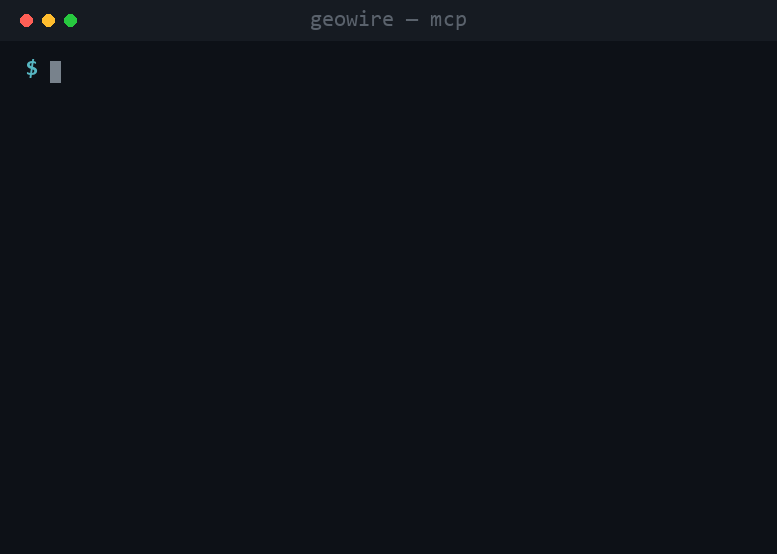
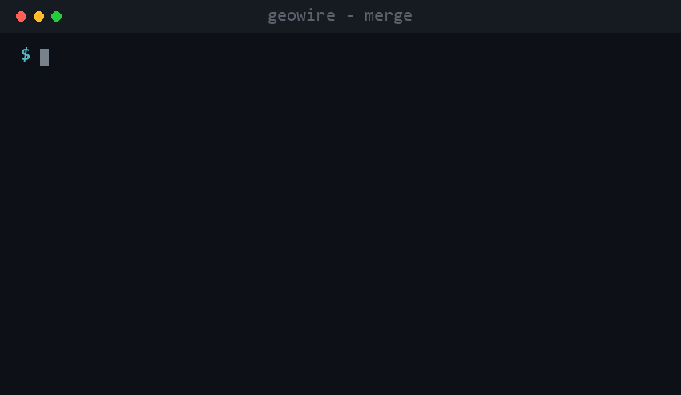

# GeoWire

> **Add real-world places to any AI agent in 5 minutes — no API key required.**
>
> One place-search interface for every AI and map provider.

<p align="center">
  
</p>

GeoWire is an open-source geo search gateway that sits between AI agents and
map/place data providers (OpenStreetMap, Google, your own data) and exposes them
through a single **MCP server**, **REST API**, and **SDK** — with provider
fallback, multi-provider merge + dedup, cost budgets, and a policy engine that
enforces each provider's caching/attribution terms.

**Status: v0.1 ("It works") — published on npm. MCP · REST · CLI · SDK all functional.**

> **Honest by design:** OpenStreetMap (the zero-key default) is a great
> *geocoder* — strong on place names, addresses, and landmarks — but thin on
> category words ("coffee", "pharmacy"), opening hours, and coverage outside
> Europe. Add a Google key for full business data; GeoWire merges both and tells
> you which source every field came from.

**Contents:** [Why](#why-geowire) · [Quickstart](#quickstart) · [MCP tools](#mcp-tools) · [REST](#rest-endpoints) · [Anatomy of a response](#anatomy-of-a-response) · [Config](#configuration-optional--everything-works-without-it) · [Providers](#providers) · [Recipes & examples](#recipes--examples) · [Roadmap](#roadmap) · [Architecture](#architecture)

## Why GeoWire?

|  | Direct integration | Single-provider MCP | **GeoWire** |
|---|---|---|---|
| Unified place schema | ❌ per-provider code | ❌ | ✅ |
| Provider fallback on failure | ❌ | ❌ | ✅ |
| Multi-provider merge + dedup | ❌ | ❌ | ✅ |
| Cost budgets & routing | ❌ | ❌ | ✅ |
| Works without any API key | ❌ | depends | ✅ (OSM by default) |
| Self-hosted | — | depends | ✅ |
| Your own place data as a provider | ❌ | ❌ | ✅ |
| Transparent provenance (which source, what cost) | ❌ | ❌ | ✅ (every response) |

**Not a Google replacement — it *uses* Google.** The thing no single provider can
do: merge **your own store data + Google + OSM** into one deduped record, with
per-field provenance (your name is authoritative, Google adds ratings, OSM adds
coordinates). Real run below:

<p align="center">
  
</p>

## Quickstart

### 1. MCP (Claude Desktop / Cursor) — 30 seconds

Add this to your MCP client config (e.g. Claude Desktop `claude_desktop_config.json`):

```json
{
  "mcpServers": {
    "geowire": { "command": "npx", "args": ["-y", "@geowirehq/mcp"] }
  }
}
```

Then ask: *"Where is the Eiffel Tower?"* or *"Find a Starbucks within 3 km of
37.4979, 127.0276."* Works with **zero API keys** — OpenStreetMap is the default.
Add `"env": { "GOOGLE_MAPS_API_KEY": "..." }` for business listings and hours
(e.g. *"Find a 24-hour pharmacy near me"*). See [more MCP client configs](./examples/mcp-clients.md).

### 2. CLI — one-shot search & server

<p align="center">
  
</p>

```bash
npx @geowirehq/cli search "Eiffel Tower"          # terminal search with a results table
npx @geowirehq/cli search "Starbucks" --near 37.4979,127.0276 --radius 3000   # near a coordinate
npx @geowirehq/cli reverse 37.5665,126.9780       # coordinate → nearest place
npx @geowirehq/cli route 37.5665,126.9780 37.4979,127.0276   # driving directions (no key, OSRM)
npx @geowirehq/cli get google:ChIJ...             # one place by reference (getPlace-capable provider)
npx @geowirehq/cli                                # start the REST + MCP server (zero-config)
npx @geowirehq/cli init                           # interactive setup wizard (.env + config)
npx @geowirehq/cli test                           # check provider connections
```

Add `--json` to any command for the full response (results + provenance `meta`).

### 3. Docker — self-hosted server

```bash
docker run -p 4980:4980 geowire/geowire
# then:
curl -X POST http://localhost:4980/v1/places/search \
  -H 'content-type: application/json' \
  -d '{"query":"Starbucks","near":{"latitude":37.4979,"longitude":127.0276},"radiusMeters":3000}'
```

Or with `docker compose up` (see `docker-compose.yml`). API docs at `/docs`.

### 4. SDK (embedded)

```ts
import { createGeoWire } from "@geowirehq/core";
import { createNominatimProvider } from "@geowirehq/provider-nominatim";

const geo = createGeoWire({ providers: [createNominatimProvider()] });
const { results, meta } = await geo.searchPlaces({
  query: "Starbucks",
  near: { latitude: 37.4979, longitude: 127.0276 },
  radiusMeters: 3000,
});
```

Full embedded-SDK guide: [`examples/typescript-sdk.md`](./examples/typescript-sdk.md).

## MCP tools

| Tool | Description |
|---|---|
| `search_places` | Natural-language + coordinate/region place search |
| `get_place` | Details by `provider:providerPlaceId` reference |
| `geocode_address` | Address → coordinates (+ normalized address) |
| `reverse_geocode` | Coordinates → nearest address |
| `get_directions` | Route between waypoints (distance, time, legs) — no key (OSRM) |
| `distance_matrix` | N×M travel distances/times — rank candidates by drive time — no key |
| `analyze_area` | Commercial-area analysis: category density, competition, rating landscape |
| `list_geo_providers` | Active providers, capabilities, status (agent self-awareness) |

Every response includes both a human-readable summary and `structuredContent`
(schema-valid JSON).

## REST endpoints

| Method | Path | |
|---|---|---|
| POST | `/v1/places/search` | search |
| GET | `/v1/places/{ref}` | place details (`provider:id`) |
| GET | `/v1/geocode?address=` | geocode |
| GET | `/v1/reverse-geocode?lat=&lon=` | reverse geocode |
| POST | `/v1/directions` | directions between waypoints (no key) |
| POST | `/v1/distance-matrix` | N×M travel distance/time matrix (no key) |
| POST | `/v1/analyze-area` | commercial-area analysis (density, competition, ratings) |
| GET | `/v1/providers` | list providers |
| GET | `/v1/health` | health check |
| GET | `/metrics` | Prometheus metrics |
| GET | `/docs` | Swagger UI (OpenAPI 3.1) |
| POST | `/mcp` | MCP over Streamable HTTP |

Optional Bearer auth: set `GEOWIRE_API_KEYS=key1,key2`.

## Anatomy of a response

No black box. Every response carries a `meta` block: which providers were
**used / skipped / failed** (and why), dedup counts, cache status, estimated
cost, and per-field sourcing — so you always know where each value came from.

```jsonc
{
  "results": [{
    "id": "gwp_CvWvRZrFtegkJPxP9CW0",
    "name": "경복궁",
    "location": { "latitude": 37.579754, "longitude": 126.9766818 },
    "sources": [{
      "provider": "nominatim",
      "providerPlaceId": "relation/5501517",
      "fields": ["name", "location", "categories", "address"]   // ← what this source contributed
    }],
    "attributions": ["© OpenStreetMap contributors"]
  }],
  "meta": {
    "providersUsed":   [{ "provider": "nominatim", "resultCount": 1, "latencyMs": 2449 }],
    "providersSkipped": [],   // e.g. { provider: "google", reason: "MISSING_CREDENTIALS" | "QUOTA_EXCEEDED" }
    "providersFailed":  [],   // e.g. { provider: "google", reason: "TIMEOUT" }
    "strategy": "first-success",
    "cache": { "hit": false }
    // merging adds:  "dedup": { "before": 3, "after": 1 }
    // paid provider: "estimatedCostUSD": 0.032
  }
}
```

After a merge, `sources[].fields` shows (say) the phone came from Google while
the coordinates came from OSM. Walkthrough: [docs/recipes.md](./docs/recipes.md#4-read-a-response-provenance--transparency).

## Configuration (optional — everything works without it)

`geowire.config.yaml`:

```yaml
providers:
  nominatim: { enabled: true }                       # default ON, no key
  google:    { enabled: true, apiKey: ${GOOGLE_MAPS_API_KEY} }
  kakao:     { enabled: true }                        # env KAKAO_REST_API_KEY (KR)
  naver:     { enabled: true }                        # env NAVER_CLIENT_ID + NAVER_CLIENT_SECRET (KR)
  internal:  { enabled: true, source: ./my-places.csv, priority: 100 }
routing:
  defaultStrategy: merge          # first-success | merge | cost-aware | weighted | fastest
  providerWeights:                # for `weighted`: order by priority·cost·coverage
    priority: 0.5
    cost: 0.3
    coverage: 0.2
budget:
  perRequestMaxUSD: 0.10          # over-budget paid providers are skipped, free ones used
```

Keys come from the environment (`${VAR}`), never committed in plaintext.

## Providers

| Provider | Key? | Capabilities |
|---|---|---|
| `@geowirehq/provider-nominatim` (OpenStreetMap) | none | search, geocode, reverseGeocode |
| `@geowirehq/provider-osrm` (OpenStreetMap routing) | none | route, distanceMatrix |
| `@geowirehq/provider-google` (Maps Platform) | BYOK | search, geocode, reverseGeocode, getPlace, route, distanceMatrix |
| `@geowirehq/provider-kakao` (카카오맵, KR) | BYOK `KAKAO_REST_API_KEY` | search, geocode, reverseGeocode |
| `@geowirehq/provider-naver` (네이버 지역검색, KR) | BYOK `NAVER_CLIENT_ID`+`NAVER_CLIENT_SECRET` | search, geocode |
| `@geowirehq/provider-baidu` (百度地图, CN) | BYOK `BAIDU_MAP_AK` | search, geocode, reverseGeocode |
| `@geowirehq/provider-foursquare` (global POI) | BYOK `FOURSQUARE_API_KEY` | search, getPlace |
| `@geowirehq/provider-internal` (your CSV) | none | search |

Regional providers make Korea (Kakao/Naver) and China (Baidu) coverage
first-class where OSM is thin and Google has gaps — Baidu returns BD-09
coordinates, which GeoWire converts to WGS84 automatically. Merge them all +
your own store data into one deduped record.

### Provider roles — each provider does what it's best at

Providers aren't interchangeable; they're **complementary**. When `merge` combines
duplicates, GeoWire doesn't just pick the highest-priority provider's whole record —
it sources **each field from the provider that's authoritative for it**. Every
provider declares its strengths in its manifest (`fieldAuthority`), so one merged
place can carry OSM's coordinates, Google's reviews, and Kakao's local name at once:

| Provider | Authoritative for | Role |
|---|---|---|
| Nominatim / OSM | `location`, `address` | base map geometry & addresses |
| Google | `business` (rating, hours, **reviews**), `contact` | rich business data |
| Foursquare | `business` (**photos**, price), categories | global POI specialist |
| Kakao / Naver / Baidu | `name`, `address` | country-specific local names |
| Internal (your CSV) | `name`, `contact`, `business` | your own data is the source of truth |

`sources[].fields` in every response records which provider contributed which field.
This is the "Stripe for Maps" idea in code: you get one clean place record, and each
part of it comes from whoever knows it best. (Reviews/photos are provider originals —
the policy engine enforces each provider's storage terms; Google originals aren't cached.)

Want another provider? See [CONTRIBUTING.md](./CONTRIBUTING.md) —
*"Write a provider in 30 minutes"*.

## Recipes & examples

- **[docs/recipes.md](./docs/recipes.md)** — end-to-end recipes: near+radius
  search, merge + dedup, cost budgets, country routing, your own CSV, self-host.
- **[examples/mcp-clients.md](./examples/mcp-clients.md)** — configs for Claude
  Desktop/Code, Cursor, Cline, VS Code, Windsurf.
- **[examples/typescript-sdk.md](./examples/typescript-sdk.md)** — embed the SDK.
- **[examples/llm-tool-use.md](./examples/llm-tool-use.md)** — raw OpenAI /
  Anthropic function calling. Also [LangChain](./examples/langchain.md) ·
  [Vercel AI SDK](./examples/vercel-ai-sdk.md).

## Roadmap

v0.1 is deliberately "It works" scope. Honest about what's **not** in it yet:

| Area | Shipped | Planned |
|---|---|---|
| Operations | search, geocode, reverse-geocode, get-place, directions, distance-matrix, **area analysis** | **autocomplete** (typed, not wired) |
| Strategies | `first-success`, `merge`, `cost-aware`, `weighted`, `fastest` | — (all 5 shipped) |
| Field sourcing | **role-based merge** (each provider's authoritative fields) | per-field config overrides |
| Routing providers | **OSRM** (no key), **Google Routes** (BYOK) | Mapbox, Valhalla, HERE |
| Routing | explicit `country`, free-first cost ordering | country **inference** from coordinates |
| Analysis | **category density / competition / rating landscape** | demographics, foot-traffic, isochrones |
| Cache | in-memory (LRU) | **Redis** adapter |
| Providers | OSM, OSRM, Google, Kakao, Naver, Baidu, Foursquare, your CSV | Mapbox, HERE, TomTom, … (community PRs welcome) |
| Rate limiting | per-provider (OSM 1 req/s) | global / per-endpoint |

## Architecture

```
AI agent / app
   │  MCP · REST · SDK
   ▼
GeoWire core  ── pipeline: plan → execute → normalize → dedup → rank → policy → cache
   │  GeoProvider contract
   ▼
providers: nominatim · osrm · google · kakao · naver · baidu · foursquare · internal · (community)
```

Monorepo packages: `schema` · `provider-sdk` · `provider-testkit` · `core` ·
`providers/*` · `mcp` · `apps/server` · `cli`.

## Documentation

- [Recipes / cookbook](./docs/recipes.md) — task-oriented, copy-pasteable
- [Examples](./examples/) — MCP clients, SDK, LangChain, AI SDK, tool use
- [Contributing + write a provider](./CONTRIBUTING.md)
- [System design](./GeoWire_system_design.md)

## License

[Apache-2.0](./LICENSE). GeoWire's code license is separate from the terms of
third-party map/place data providers — usage of Google, Mapbox, HERE, Kakao,
Naver, etc. is governed by each provider's own terms. OSM data is under ODbL;
GeoWire's policy engine enforces attribution and caching limits per provider.
